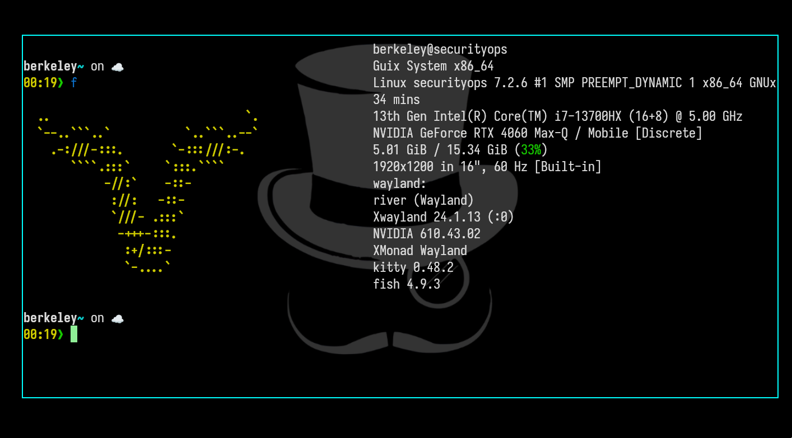

# XMonad Wayland

[English](README.md)

Gerenciador de janelas em Haskell para **River 0.4+**, usando o StackSet original
do XMonad para organizar janelas, foco e áreas de trabalho. O River cuida dos
gráficos, da entrada e dos clientes Wayland/XWayland; este projeto define como
as janelas são gerenciadas.

**A versão 0.4.0 está em desenvolvimento para GNU Guix.** Desde setembro de
2026 ela roda em uma sessão real de login com o River em um notebook Predator
Helios (NVIDIA RTX 4060 mais Intel) pelo canal SecurityOps, e em sessões
aninhadas para experimentar em qualquer desktop Wayland. A aceitação de uso
diário — suspensão, conexão de monitores, bloqueio de tela — ainda está sendo
avaliada. Este projeto é independente, sem vínculo oficial com o XMonad;
arquivos `xmonad.hs` para X11 e módulos arbitrários do `xmonad-contrib` não são
compatíveis.



Captura sem edição do desktop River do mantenedor rodando o XMonad Wayland.

## Experimentar no Guix

No diretório do projeto, com seu usuário normal:

```sh
./scripts/guix-build
./run.sh --doctor
./run.sh --nested
```

Execute o último comando dentro de um desktop **Wayland**. O River abrirá em
uma janela com um terminal Foot. Clique nela e use **Super+Return** para outro
terminal ou **Super+p** para o Fuzzel. Super é a tecla Windows/logotipo; Return é Enter.

Dentro do Sway, os atalhos são encaminhados enquanto a janela River tem foco.
**Ctrl+Alt+Escape** devolve o controle ao Sway; tire o foco do River e volte a ele
para capturar novamente. Outros compositores externos podem precisar de ajustes
próprios. Feche a janela River ao terminar. O lançador informa o diretório privado
de diagnóstico. Consulte o [guia de instalação](docs/INSTALL.pt-BR.md).

O script usa versões fixadas do Guix e River 0.4.8, executa os testes dos pacotes
e cria `build/guix-runtime` com o gerenciador, River, Foot, Fuzzel e fontes.
Seu perfil padrão, canais e sessão de login permanecem inalterados. A primeira
compilação pode demorar; o script informa onde está o registro da compilação.

## Atalhos padrão

Estes são os **padrões genéricos**, com nove áreas de trabalho. O perfil Guix
configurado separadamente para o notebook tem 74 atalhos derivados do Sway e
outros comandos. Instalar o pacote genérico não importa esse perfil.

| Atalho | Ação |
| --- | --- |
| Super+Return | Abrir o Foot |
| Super+p | Abrir o Fuzzel |
| Super+j / k | Focar a próxima janela / a anterior |
| Super+Shift+j / k | Trocar de posição com a próxima janela / a anterior |
| Super+Shift+Return | Trocar de posição com a janela principal |
| Super+Space | Alternar entre Tall, Mirror e Full |
| Super+h / l | Diminuir / aumentar a área principal |
| Super+1…9 | Ir para uma área de trabalho |
| Super+Shift+1…9 | Mover a janela focada e suas janelas transitórias |
| Super+period / comma | Focar o próximo monitor / o anterior |
| Super+t | Alternar o modo flutuante |
| Super+f | Alternar tela cheia |
| Super+Shift+c | Solicitar o fechamento do aplicativo focado |
| Super+Shift+q | Parar o gerenciador |

Parar o gerenciador não encerra nem bloqueia a sessão. O River e os aplicativos
continuam em execução. Para retomar o gerenciamento, execute `xmonad-wayland`
em um terminal dentro daquela sessão do River.

## Baixando e descompactando

Os arquivos de release usam compressão zupt no nível máximo:

```
zupt extract xmonad-wayland-0.4.2.tar.zupt   # restaura xmonad-wayland-0.4.2.tar
sha256sum -c xmonad-wayland-0.4.2.sha256     # verifique o arquivo
tar -xf xmonad-wayland-0.4.2.tar             # descompacte a árvore de código
```

O `zupt` é o compressor de backup pós-quântico do canal SecurityOps
(`zupt compress -l 9`); `zupt list` e `zupt test` inspecionam e verificam um
arquivo sem extraí-lo.

## Configuração e limites atuais

Quem migra do X11 mantém o idioma da configuração: escreva
`~/.xmonad/xmonad.hs` com `import XMonad.Wayland.XConfig` e
`main = xmonad $ def { ... }`, e rode `xmonad-wayland --recompile`.
O gerenciador executa o resultado compilado automaticamente ao iniciar e ao
reiniciar, como o XMonad faz. Consulte a [documentação de configuração](docs/CONFIGURATION.pt-BR.md)
para a superfície suportada e os limites honestos: sem `xmonad-contrib`, sem
hooks de X11 e sem `manageHook` nesta versão.

O mod+v desenha uma letra grande sobre cada janela da área de trabalho
atual, em fundo preto (estilo EasyMotion, sem abrir janela nenhuma), e a letra
escolhida troca essa janela de lugar com a focada. Escape ou um clique
cancela o seletor. Títulos e app ids continuam disponíveis na política para
futuros overlays de rótulo.

Usuários avançados podem continuar compilando um ponto de entrada Haskell
próprio com comandos, modos de teclado, áreas de trabalho, cursor e layouts
via `XMonad.Wayland.Config`, além de um arquivo de atalhos recarregável que
preserva as janelas abertas ao atualizar os atalhos.

Os layouts disponíveis são Tall, Mirror, Full, Columns, Rows, Tabbed e Stacking.
Há suporte a vários monitores, diálogos transitórios, tela cheia e superfícies
layer-shell, como o Fuzzel. Tabbed/Stacking não desenham abas, e os layouts se
aplicam à área de trabalho inteira, sem a árvore de contêineres aninhados do Sway.

Uma sessão física está em uso no notebook do mantenedor desde setembro de 2026,
incluindo a saída NVIDIA DRM direta. Suspensão, conexão de monitores, bloqueio
de tela e uso diário prolongado ainda estão sendo avaliados. Entrada,
notificações, portais, papel de parede e bloqueio precisam de programas e
configuração de sessão próprios. Políticas independentes para vários seats e
persistência de layouts após reiniciar o gerenciador ainda não estão
implementadas.

## Licença e origem do código

O projeto usa a **licença BSD de 3 cláusulas**, a mesma do XMonad. O StackSet
incluído mantém os direitos autorais e a licença originais. Os arquivos XML dos
protocolos do River mantêm a licença MIT. Consulte [LICENSE](LICENSE),
[origem do código](docs/PROVENANCE.md) e [limites de segurança](docs/SECURITY.pt-BR.md).
